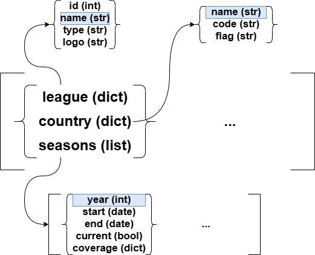

# Source Data

So just by googling open source football data quite a few come up including statsbombpy, football.db, football-data.org and API-football. I think the main this i want to seee is how easy it is to filter down to a single competition season.

## [Statsbombpy](https://github.com/statsbomb/statsbombpy)
So this ended up being quite simple. Firsly, this is a python package that can be stored and then it seems like you use built in fucntions to query the API. You can be pay statsbomb to access a large amount of data but without authentication you still have access to their open data source. 

To install you simple run the following command
```python
pip install statsbombpy
```

and now you're ready to get started.

In your python file you will want to import a file called sb as so

sb has a collection of functions which can be used to return different available datasets.
The functions are competitions(), matches(), lineups(), events() and competition_events() - there are more but these are the main ones - and they are all quite self explanatory and returns a dataframe which is much appreciated. For my goal of filtering to a single competition I would get I would only need to use competitions()

To workout how to filter down to a specific competition season, I first needed to know which fields I had available.

```python
from statsbombpy import sb

competitions_df = sb.competitions()

print(competitions_df.columns.values)
```

```
>>>['competition_id', 'season_id', 'country_name', 'competition_name', 'competition_gender', 'competition_youth', 'competition_international', 'season_name', 'match_updated', 'match_updated_360', 'match_available_360', 'match_available']
```

competition_name and season_name seemed like strong candidates for columns that would define a competition season whilst also giving enough context so that anyone could tell which competition season each combinations would represent. Next, I wanted to look at the data that was available

```python
from statsbombpy import sb

competitions_df = sb.competitions()

print(competitions_df[['competition_name','season_name']].sort_values(by='season_name'))
```

```
>>>          competition_name season_name
35          FIFA World Cup        1958
34          FIFA World Cup        1962
33          FIFA World Cup        1970
20        Champions League   1970/1971
19        Champions League   1971/1972
..                     ...         ...
57                 Ligue 1   2022/2023
60     Major League Soccer        2023
70       Women's World Cup        2023
2   African Cup of Nations        2023
0            1. Bundesliga   2023/2024
```

This result opened my eyes to a couple things. By using this dataset the only league available from the most recent season is the German top flight and when looking for the previous 1. Bundesliga season (2022/2023) I receive an error.

```python
from statsbombpy import sb

competitions_df = sb.competitions()

bundesligas_df = competitions_df[(competitions_df['competition_name'] == "1. Bundesliga")]\
                                    [['competition_id','competition_name', 'season_name']]

print(bundesligas_df)
```

```
>>>   competition_id competition_name season_name
0               9    1. Bundesliga   2023/2024
1               9    1. Bundesliga   2015/2016
```

So although we can filter down a single competition season with a function and some simple dataframe stuffs it appears the availability of data isn't phenomenal and I don't really feel like paying for source data when this is currently just a pet project.

## [API-Football](https://www.api-football.com/)

Vibes and dat. Sooooo this was a little bit more tricky as ive never dealt with as i have never actually messed aroud with APIs and JSON before but 'twas fun.

So to get started I had to access a bloody api didn't I.

```python
import http.client

conn = http.client.HTTPSConnection("v3.football.api-sports.io")

headers = {
    'x-rapidapi-host': "v3.football.api-sports.io",
    'x-rapidapi-key': "xXxXxXxXxXxXxXxXxXxXxXxXxXxXxXxXx"
    }

conn.request("GET", "/leagues", headers=headers)

res = conn.getresponse()
data = res.read().decode("utf-8")
```

http is a package that collects several modules for working with the HyperText Transfer Protocol. http.client is just a low-level HTTP protocol client and is a low-level HTTP protocol client defining classes that implement the client side of the HTTP and HTTPS protocols. One of those classes is HTTPSConnection.

HTTPSConnection is actually a sub-class of HTTPConnection. An HTTPConnection instance represents one transaction with an HTTP server. I've given it the name of the server's domain and it will default the port to port 80 - this is the port that will be expecting a response. With HTTPSConnection SSL is used for the communication and the default port is 443. cba to explain SSL and I don't know much about it other than it encrypts messages between machines and servers for security.

Request is a HTTPConnection object that sends a request to the server using a method, in this case "GET" and a url. Normally you have to define the absolute path but the alternative is connecting to a http proxy server and the required url is just an extension.

I define a host url with x-rapidapi-host aswell as an API key with x-rapidapi-key in the headers dictionary. To get a key you need to sign up for one the api-football website. It's pretty easy and there is a free option where you're limited to 100 requests a day which slows down development but hey ho. Once a request has been sent getresponse returns a HTTPResponse and read returns the body of the response then we decode the body from utf-8.

Jumping into the data now. When it comes in, it looked like json stored in a string. 

```python
comp_data = json.loads(data) #leag = league
```

This stores the data as a dictionary called leag_data which had the following key:

- 'get'
- 'parameters'
- 'errors'
- 'results'
- 'paging'
- 'response'

get returns the name of the request extenion

```python
comp_data_get = leag_data.get('get')
print(leag_data_get)
```
```
>>>leagues
```

parameters and errors returned an empty lsit for me. I believe parameters returns any filters you include in your request's url which i didn't use and my request went through so there were no errors but this could be useful in future whilst developing.

Slight spoiler alert but results is a integer equal to the number elements that are found in response which is a list
```python
comp_data_rs = leag_data.get('results')
print(leag_data_rs)
```
```
>>>1112
```

Paging gives details about the page of the response you're currently viewing and how many pages there are. for leagues there was only 1 but can imagine teams, players and events could get quite large

```python
comp_data_pg = leag_data.get('paging')
print(leag_data_pg)
```
```
>>>{'current': 1, 'total': 1}
```

Finally response is where the money is
```python
comp_data_rsp = leag_data.get('response') #rsp = response
print(leag_data_rsp)
```
and this returns a rather large list of dictionaries where each dictionary represents a competition.



This is a rough breakdown of how the list comp_data_rsp is stored and how it needs to be accessed. In this data set league name doesn't seem to be unique as there are 20+ competitions called "Premier League"(the English Premier League has league id 39) so the unique combination for a competition appears to be league name and country name. Finally to get our desired combination of competition season all we are missing is the seasons year.

```python
compet_szns = []
for compet in compet_data_rsp: #A[i]
    if compet.get('league').get('id') == 39: 
        compet_name = [compet.get('league').get('name')]
        compet_cntry = [compet.get('country').get('name')]
        for szn in (compet.get('seasons')):
            szn_year = szn.get('year')               
            compet_szn = compet_id + compet_cntry + [szn_year]
            compet_szns += [compet_szn]

print(compet_szns)
```

```
>>>[['Premier League', 'England', 2010], ['Premier League', 'England', 2011], ['Premier League', 'England', 2012], ['Premier League', 'England', 2013], ['Premier League', 'England', 2014], ['Premier League', 'England', 2015], ['Premier League', 'England', 2016], ['Premier League', 'England', 2017], ['Premier League', 'England', 2018], ['Premier League', 'England', 2019], ['Premier League', 'England', 2020], ['Premier League', 'England', 2021], ['Premier League', 'England', 2022], ['Premier League', 'England', 2023]]
```

So using a combination of league name, country name and seasons year we can identify a unique competition season.

Next thing I want to do is unpack all the data where needed into a table format with the keys being as above.

## Honourable Mentions

### [football.db](https://openfootball.github.io/)
Um looked cool buuuuut I didn't understand the intro and looked like i needed javascript/djngo...yeah nope

### [football-data.org](https://www.football-data.org/)
Didn't actually give this one a try as I'd already worked on API-Football they looked quite similar - might come back and look later.